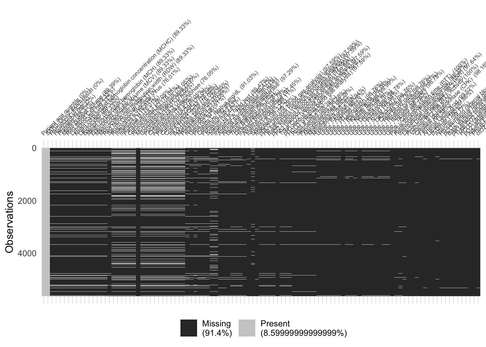

# De-identified Laboratory tests data for Covid-19

Here are my attempts to find a good predictive model for the Kaggle "competition" called [De-identified Laboratory tests data for Covid-19](https://www.kaggle.com/einsteindata4u/covid19/). Anyone is free to use my code to be inspired and try something different.

A HTML file with my results is available [here](https://htmlpreview.github.io/?https://github.com/mnunes/einstein-covid-19/blob/master/code.html). I got a very good sensitivity (0.99528), but my specificity (0.05036) is very low.

I got my final model. 90% accuracy using random forest. But as the response variable is unbalanced, with 90% for one class and 10% for another, my model is useless.

I tried many things, like data filtering and imputation, but nothing worked for me.

I have little hope that, with this specific data set, it would be possible to fit a good predictive model. Perhaps with a very good feature engineering? Maybe, but there is a lot of missing data. In the original dataset, without pre-processing, there is 91% of missing data, as shown in the figure below.

